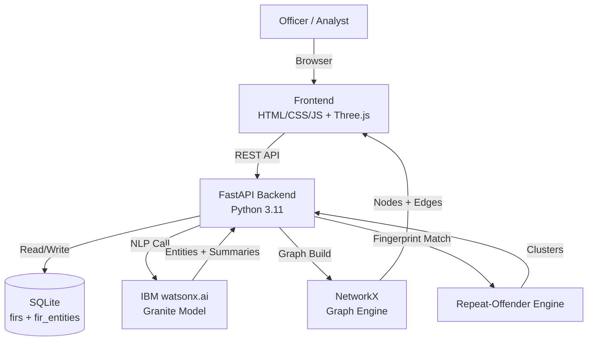

# Architecture

## System Diagram

## Component Table

| Component | Technology | Responsibility |
|---|---|---|
| Frontend shell | Vanilla HTML/CSS/ES modules | SPA router, 6 views |
| API client | `js/api.js` | REST calls with error handling |
| Charting | Chart.js 4.4 | Bar, doughnut, radar charts |
| 3D graph | 3d-force-graph + Three.js | Interactive network visualization |
| Backend | FastAPI 0.110 | 12+ REST endpoints, CORS, OpenAPI docs |
| DB layer | SQLite + `db.py` | Schema, CSV loader, query helpers |
| NLP client | `nlp/bob_client.py` | IBM watsonx.ai wrapper with mock fallback |
| Extractor | `nlp/extractor.py` | Entity extraction + SQLite caching |
| Summarizer | `nlp/summarizer.py` | Station briefings via Bob |
| Fingerprint engine | `engine/fingerprint.py` | Cluster detection + alias matching |
| Analytics | `engine/analytics.py` | Dashboard aggregations |

## End-to-End Data Flow

1. **Startup** — FastAPI lifespan loads CSV → SQLite (one-time). Entities table initialized.
2. **Dashboard load** — Frontend calls `/api/dashboard` → SQL aggregates → JSON → Chart.js renders.
3. **FIR Explorer** — Frontend calls `/api/firs?filters` → paginated table.
4. **Repeat Offender detection** — `/api/repeat-offenders`:
   - Load all FIRs
   - Compute fingerprint per row (SHA1 of normalized signature)
   - Group by fingerprint
   - Score confidence from matched components
   - Return clusters sorted by FIR count
5. **Alias detection** — `/api/alias-links`:
   - Query `accused_name + accused_alias`
   - Group by name; filter groups with >1 unique alias
6. **Network graph** — `/api/network`:
   - Return nodes (accused, FIR, state, MO) + edges (appeared_in, in_state, used_mo)
   - Client renders with 3d-force-graph
7. **Query** — `POST /api/ask`:
   - Keyword extraction from question
   - LIKE-search over narratives → context
   - Bob synthesizes answer with citations

## Security Notes

- **No authentication** — intended as an internal analyst tool. Production would add SSO.
- **`.env` never committed** — enforced via `.gitignore`.
- **CORS whitelist** — only localhost origins by default.
- **No PII in logs** — mock data is synthetic.

## Scalability Notes

| Current | Production path |
|---|---|
| SQLite | PostgreSQL + read replicas |
| In-memory NetworkX | Neo4j or TigerGraph |
| Sequential Bob calls | Async batch + Redis queue |
| 300-node graph cap | Server-side graph sampling |
| Single-process uvicorn | Kubernetes + horizontal pods |
| No vector search | Add FAISS / pgvector for RAG |